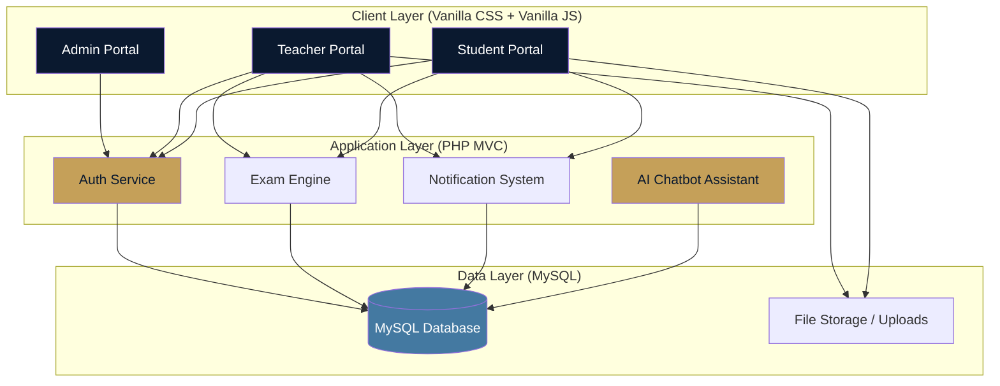
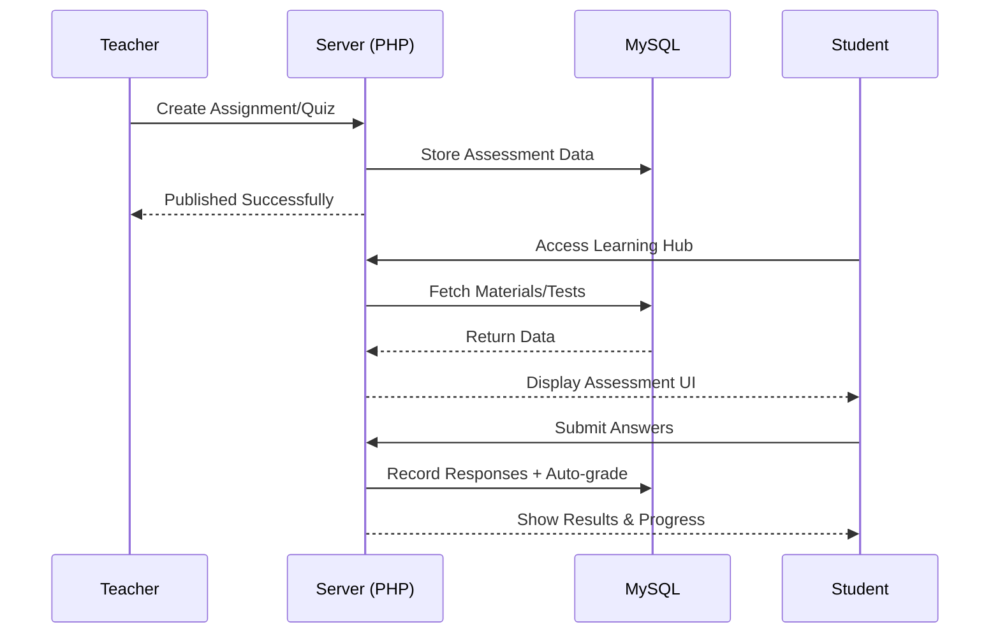

# Qudrat (Capacities Platform) | منصة قدرات


[](https://www.php.net/)
[](https://www.mysql.com/)
[](https://developer.mozilla.org/en-US/docs/Web/CSS)
[](https://developer.mozilla.org/en-US/docs/Web/JavaScript)
[](https://opensource.org/licenses/MIT)

> A comprehensive, premium Learning Management System (LMS) designed to bridge the gap between educational administration, teaching excellence, and student success. Unified by a sleek "Midnight Obsidian" design with glassmorphism effects.

## 🌟 Overview

**Qudrat** is a high-end educational ecosystem designed to centralize and streamline the learning experience. It features 3 dedicated portals for Administrators, Teachers, and Students, all unified by a modern, responsive, and bilingual interface.

## ✨ Key Features

### 🛡️ 1. Admin Dashboard
- **User Management** - Advanced CRUD operations for Admins, Teachers, and Students.
- **Course Orchestration** - Centralized control over course offerings and academic structure.
- **Dynamic Reporting** - Insightful overview of system statistics, attendance trends, and grade distributions.
- **Advanced RBAC** - Role-Based Access Control to manage all users and permissions.

### 🎓 2. Teacher Portal
- **Course Mastery** - Upload and organize learning materials including PDF, Video, and Images.
- **Assessment Engine** - Create and manage assignments and quizzes with automatic grading.
- **Attendance Tracking** - Real-time attendance monitoring (Present/Absent/Late).
- **Grade Management** - Interactive interface for grading and providing instant feedback.

### 👤 3. Student Experience
- **Interactive Enrollment** - Easy browsing and enrollment in available courses.
- **Learning Hub** - Quick access to all materials, schedules, and assignment submissions.
- **Progress Tracking** - Real-time notifications and grade charts to monitor academic growth.
- **Integrated Chatbot** - AI-driven support for instant user assistance.

## 🏗️ Architecture Overview



## 🚀 Tech Stack

### Frontend
- **Vanilla CSS3** - Custom "Midnight Obsidian" theme with glassmorphism.
- **Vanilla JavaScript** - High-performance core logic.
- **Bilingual Support** - Native AR/EN localization.
- **Responsive Design** - Optimized for Mobile, Tablet, and Desktop.

### Backend
- **Native PHP (MVC)** - Secure, high-performance backend architecture.
- **MySQL** - Optimized database structure with foreign keys and indexing.
- **Role-Based Access** - Secure multi-portal authentication.
- **Custom AI Chatbot** - Integrated assistant for user guidance.

## 📊 Data Flow (Assessment System)



## 🗂️ Project Structure

```
Qudrat/
├── 📁 app/                    # Core application logic (Models, Controllers)
├── 📁 views/                  # UI Templates (Portals, Landing Page)
├── 📁 public/                 # Entry point & Static Assets (CSS, JS, Images)
├── 📁 database/               # Database migrations & SQL schema
├── 📁 docs/                   # Documentation & Media assets
├── 📁 includes/               # Reusable components
├── 📁 uploads/                # User uploads & Educational materials
├── 📄 config.ini              # App configuration
├── 📄 index.php               # Front controller
└── 📄 README.md               # Project documentation
```

## 🛠️ Installation & Setup

### 1. Clone the Repository
```bash
git clone https://github.com/m7mdmoghazy/Qudrat.git
cd Qudrat
```

### 2. Database Configuration
1. Import the SQL file from `database/` into your MySQL server.
2. Configure your database credentials in `config.ini`:
```ini
[database]
host = "localhost"
user = "root"
pass = ""
name = "qudrat_db"
```

### 3. Run Locally
Place the project in your local server directory (e.g., `xampp/htdocs`) and access it via:
`http://localhost/Qudrat/`

## 🔐 Security & UI Features
- **MVC Architecture** - Clean separation of concerns for maintainability.
- **Bilingual UI** - Seamless switching between Arabic and English.
- **Dark/Light Mode** - Professional theme switching for better accessibility.
- **AI Integration** - Smart chatbot for real-time user assistance.

---

<div align="center">
  <p>Developed with ❤️ by <b>Mohamed Moghazy</b></p>
  <p>
    <a href="#-qudrat-capacities-platform--منصة-قدرات">⬆ Back to top</a>
  </p>
</div>
